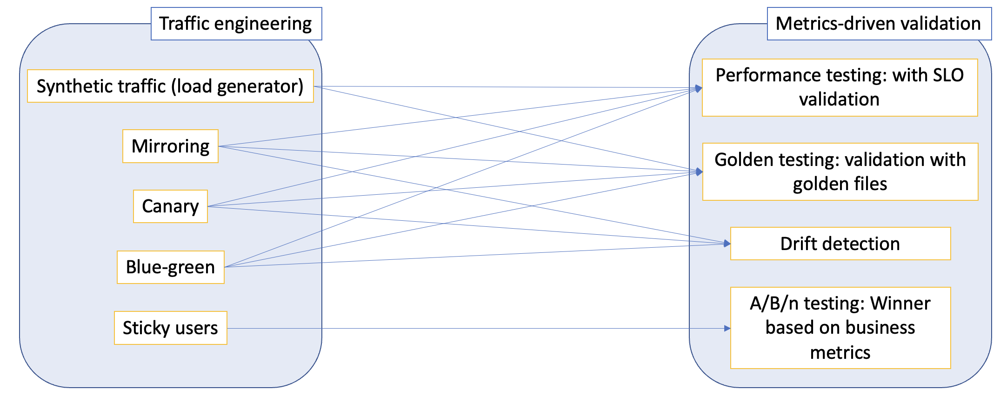

# Iter8

## Keywords

Iter8, experiment, A/B testing, Performance testing, traffic engineering, canary, blue-green, mirroring, model serving, metrics collection, version 

## What is Iter8?

[Iter8](https://iter8.tools) is the open source Kubernetes release optimizer built for DevOps, MLOps, data science, and platform engineering teams. Iter8 detects new variants of ML inference services in the cluster and optimizes their release.

## User Use Cases

Iter8 simplifies traffic engineering and metrics-based testing/validation for ML inference services running in Kubernetes/OpenShift clusters. Specific usecases are as follows.

## Advantages of Iter8+service-mesh over vanilla service-mesh

**Reliable route automation:** Iter8 controller dynamically reconfigures routing resources based on the state of ML inference services. As part of this dynamic reconfiguration, Iter8 also looks into readiness (for e.g., in a KServe modelmesh based inference service), availability (for e.g., in a Kubernetes deployment based inference service) and other relevant status conditions before configuring traffic splits to candidate versions of the inference service. Similarly, before candidate versions are deleted, Iter8 controller uses finalizers to first ensure that all traffic flows to the primary version of the inference service. This makes for a very high-degree of reliability and zero-downtime/loss-less rollouts of new inference service versions. Users do not get this reliability automatically with a vanilla service mesh.

**Ease-of-use/reduced barrier to entry:**  Platform engineers/SREs/MLOps/data science teams may not all come with the level of expertise needed for configuring routing resources for the traffic engineering use-cases supported by Iter8. Further, CRDs (like KServe modelmesh) bring an additional layer of complexity since they define their own networking mechanisms (e.g., gRPC headless services in the case of modelmesh). With Iter8, the barrier to entry for end-users is significantly reduced. In particular, by just providing names of their ML serving resources, and (optional) traffic weights/labels, endusers can get started with their release optimization use cases rapidly. Further, Iter8 does not limit the capabilities of the underlying service mesh in anyway. This means more advanced teams still get to use all the power of the service-mesh alongside the reliability and ease-of-use that Iter8 brings.

**Metrics-driven assessments of candidate versions including A/B/n testing:** Traffic engineering is merely "one-half" of Iter8 functionality as shown in the illustration. Another complementary side involves metrics-driven experiments. During a canary release, how does the user evaluate the canary version? Perhaps the user wants to split traffic between the primary and candidate versions (can be multiple), compare them in terms of business metrics such as conversion rate, engagement, revenue, sales, or any application metric that the business owners care about, and determine the winning version to be promoted. This is classic A/B/n testing for which Iter8 has significant built-in support, both for metrics collection and comparison/assessment of versions. Users can also use Iter8 for other types of validation such as SLOs, and performance tests. Clearly, vanilla service mesh does not deliver any of these features for users.

## Architecture and Implementation

[Iter8 architecture and implementation](https://iter8.tools).

Iter8 has a cluster-side component (controller + a service) that runs inside the Kubernetes/OpenShift cluster and a client-side component (CLI) that runs in the user's local machine or within a CI/CD pipeline. Both these components are implemented in `Golang` as part of [this GitHub repo](https://github.com/iter8-tools/iter8).

1. The cluster-side component enables the traffic engineer use-cases and additionally provides a service that supports Iter8's A/B/n testing SDK. This component is packaged as a Helm chart and also a Kustomize overlay, and can be installed in the cluster using either of these tools.
2. The CLI enables launching experiments for assessing inference services using metrics. The CLI is installed using `go install`.

## Owners Information and Maintenance Plan

### IBM

- Alan Cha (IBM Research)
- Michael Kalantar (IBM Research)
- Srinivasan Parthasarathy (IBM Research)
- Atin Sood (IBM Research)

### Red Hat

- Taneem Ibrahim (RHODS)

We also plan to continue consulting with Nick Hill (IBM) and Darrel Reimer (IBM Research) as we maintain and evolve Iter8.
