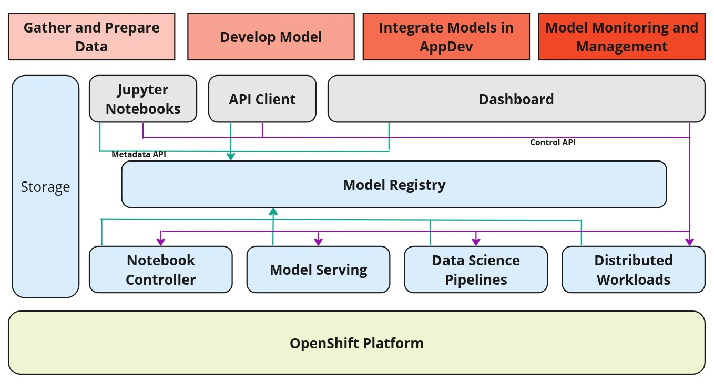

**Introduction**

Model Registry in an ML DevOps environment is a central repository for storing metadata about ML models.
It is an important component in the life cycle of AI/ML models.
A model registry provides a central repository for model developers to store and manage models, versions, and model metadata.
It fills a gap between model experimentation and model serving activities. It provides a central interface for
stakeholders in the ML life cycle to collaborate on models in a secure fashion.

During the development and deployment life cycle of an ML model, various artifacts and metadata are created or associated with the ML model.
For example, a *Data Scientist* may create training data, hyperparameters, metrics during development.
During deployment, an *MLOps Engineer* may work with a versioned Model from the repository for model-serving to provide Inferencing on the Model.
Pre-trained ML models such as Foundation Models when used directly for model serving will include metadata about their artifacts and hyperparameters.
Model serving will generate metrics from inference.
Execution of actions and events performed during the model's lifecycle, for example in a pipeline that executes various steps to process and transform data, can also be stored as metadata.

There needs to be a central repository for all such metadata so that it can provide visibility across the entire lifecycle of the model.
It should be able to provide lineage and provenance for any artifact or metadata related to an ML model.

**Design Goals**

* Model Registry should be a passive repository which receives and stores ML model related metadata pushed to the registry.
* The registry may have simple rules for validating metadata, but it does not take any actions or perform any orchestration based on this metadata.
* The metadata can be pushed to the repository using client libraries in code written by ML users or automatically generated by other ODH components in the platform.
For example, metadata about the deployment status of an ML Model.
* The Model Registry should also support Kubernetes native deployment just like other Open Data Hub Components.
* It should be also possible to register a model that has not been trained in Open Data Hub

**User Use Cases**
- *Data Scientists* need access to a Model Registry to store information about Experiments and Runs for Tracking and reproducibility.
- *Data Scientists* can register versions of ML models in the Model Registry to share with other *Data Scientists* and *MLOps Engineers*.
- *Data Scientists* and *MLOps Engineers* can design and implement kubeflow pipelines that register their artifacts and executions in the Model Registry.
- *Data Scientists* and *MLOps Engineers* can browse the Model Registry to deploy ML models to various environments (e.g. deployment stages like *Stage* and *Production*, locations like *East, West* or specific devices).

## Architecture
The high level architecture for an OpenDatahub Model Registry is depicted below.

NOTE: The Model Registry is a passive repository for metadata and is not meant to be a Control Plane. It does not perform any orchestration or expose APIs to perform actions on underlying OpenShift AI components.

We envision this to be more of a backing store for various stages of MLOps that can log user flow of a model development and deployment. The model registry will meet a data scientist's need to be able to visualize a model’s lineage and trace back the training executions, parameters, metrics, etc. It will also help deployment engineers visualize model pipeline events, actions, progress through deployment stages, etc.

------------------------------------------------------------------------------------------------------------------------------

## Implementation

Google community project ML-Metadata will be used as the core component to build the Model Registry. ML-Metadata  provides a very extensible schema that is generic in nature, similar to a key-value store, but also allows for the creation of logical schemas that can be queried as if they were physical schemas. Those can be manipulated using their bindings in the Python library. We intend to use this model to extend and provide metadata storage services for model serving, also known as Model Registry.

The model registry will use ml-metadata project’s C++ server as it is given to handle the storing of the metadata while domain specific Model Registry features will be added as extensions (aka microservices). As part of this extension we will develop Python/Go extensions to support the Model Registry and will also develop a OpenAPI interface to expose the Model Registry API to the clients.

Enforcing of RBAC policies will be handled at the OpenAPI API layer using service accounts with Authorino, which is currently not supported by ml-metadata

## Components

This section will describe briefly the different components of the system.

### MLMD C++ Server
This is the metadata server from Google's ml-metadata project.  This component is hosted to communicate with a backend relational database that stores the actual metadata about the models. This server exposes a “gRPC” interface for its clients to communicate with. This server provides a very flexible schema model, where using this model one can define logical data models to fit the needs of different MLOps operations, for example, metadata during the training and experimentation, metadata about metrics or model versioning, etc.

### OpenAPI/REST Server
This component exposes a higher-level REST API of the Model Registry. In contrast, the MLMD server exposes a lower level generic API over gRPC, whereas this REST server exposes a higher level API that is much closer to the domain model of Model Registry, like
* Register a Model
* Version a Model
* Get a catalog of models
* Manage the metadata of a model

The REST API server converts its requests into one or more underlying gRPC requests on the MLMD Server. This layer is mainly designed to be used with UI.

### Model Registry Controller
Model Registry controller is also called Model Registry Operator. The main purpose of this component is to install/deploy components of the Model Registry stack on the OpenShift. Once the components are installed, the reconciler in the controller will continuously run and monitor these components to keep them healthy and alive.

### CLI
CLI, a command line tool for interacting with Model Registry. This tool can be used by a user to execute operations such as retrieving the registered models, get model’s deployment status, model’s version etc.

## Owners Information and Maintenance Plan
Ramesh Reddy - RHOAI team - Red Hat

Dhiraj Bokde - RHOAI team - Red Hat

Matteo Mortari - RHOAI team - Red Hat

Andrea Lamparelli - RHOAI team - Red Hat

Isabella do Amaral - RHOAI team - Red Hat

Tony Davidson - RHOAI QE team - Red Hat

The owners are committed to maintaining and testing the Model Registry with each new release of its every component and ODH.

## More Info
- ML-metadata community ticket: https://github.com/google/ml-metadata/issues/185
- Kubeflow community ticket: https://github.com/kubeflow/kubeflow/issues/7396
- Tracker Issue: https://github.com/opendatahub-io/model-registry/issues/95
