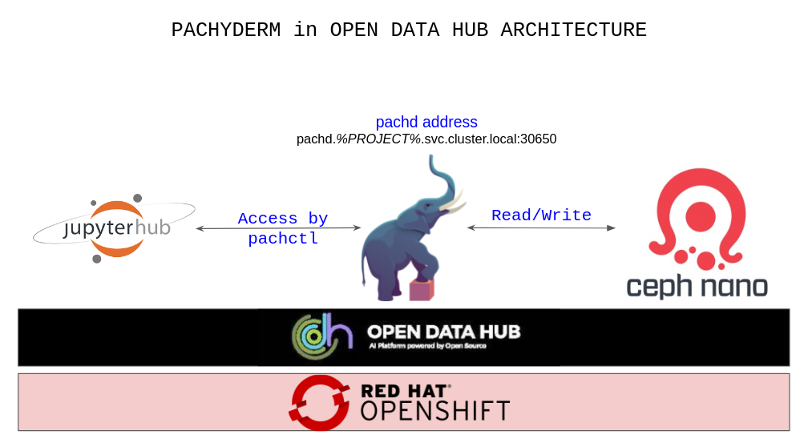

[Pachyderm](https://www.pachyderm.com/products/) is the data foundation for machine learning and offers three different products to fit all machine learning operationalization (MLOps) needs.

The Pachyderm platform brings together [version control for data](https://docs.pachyderm.com/2.0.x/concepts/data-concepts/) with the tools to build scalable [end-to-end ML/AI pipelines](https://docs.pachyderm.com/2.0.x/concepts/pipeline-concepts/) while empowering users to develop their code in any language, framework, or tool of their choice. Pachyderm has been proven to be the ideal foundation for teams looking to use ML and AI to solve real-world problems in a reliable way.

*The Pachyderm platform includes the following main components*

- Pachyderm File System (PFS)
- Pachyderm pipelines

*The Pachyderm Features*
- Automated Data Versioning
- Data-Driven Pipelines
- Immutable Data Lineage


## Architecture


## User Use Cases
- [Use Cases](https://www.pachyderm.com/use-cases/)
- [Case Study](https://www.pachyderm.com/case-studies/)

## Implementation

**Pachyderm in Open Data Hub**


Inside Open Data Hub, installing Pachyderm is easy because it will use ODH component [Ceph Nano](https://github.com/opendatahub-io/odh-manifests/tree/master/ceph) bucket by default. Moreover, ODH provides [Jupyterhub](https://github.com/opendatahub-io/odh-manifests/tree/master/jupyterhub) that can access the installed pachyderm cluster. The image above describes how components are integrated. However, note that Pachyderm in ODH also provides a way to use other storages as well. To explain a little more in detail, ODH installs Pachyderm Operator and creates Pachyderm CR to deploy Pachyderm cluster.

**Required components for Open Data Hub default Pachyderm installation**
- [Ceph Nano](https://github.com/opendatahub-io/odh-manifests/tree/master/ceph)
- [Jupyterhub](https://github.com/opendatahub-io/odh-manifests/tree/master/jupyterhub)

**Sample KfDef Manifest**
- KfDef for Pachyderm with Ceph Nano
  ```
    apiVersion: kfdef.apps.kubeflow.org/v1
    kind: KfDef
    metadata:
      name: opendatahub
      namespace: opendatahub
    spec:
      applications:
        - kustomizeConfig:
            repoRef:
              name: manifests
              path: odh-common
          name: odh-common
        - kustomizeConfig:
            repoRef:
              name: manifests
              path: odh-dashboard
          name: odh-dashboard
        - kustomizeConfig:
            parameters:
              - name: s3_endpoint_url
                value: s3.odh.com
            repoRef:
              name: manifests
              path: jupyterhub/jupyterhub
          name: jupyterhub
        - kustomizeConfig:
            overlays:
              - additional
            repoRef:
              name: manifests
              path: jupyterhub/notebook-images
          name: notebook-images
        - kustomizeConfig:
            repoRef:
              name: manifests
              path: ceph/object-storage/scc
          name: ceph-nano-scc
        - kustomizeConfig:
            repoRef:
              name: manifests
              path: ceph/object-storage/nano
          name: ceph-nano
        - kustomizeConfig:
            parameters:
              - name: namespace
                value: openshift-operators
            repoRef:
              name: manifests
              path: odhpachyderm/operator
          name: odhpachyderm-operator
        - kustomizeConfig:
            repoRef:
              name: manifests
              path: odhpachyderm/deployer
          name: odhpachyderm-deployer
  ```
- KfDef for Pachyderm with Other Storage
  ~~~
    apiVersion: kfdef.apps.kubeflow.org/v1
    kind: KfDef
    metadata:
      name: opendatahub
      namespace: opendatahub
    spec:
      applications:
        - kustomizeConfig:
            repoRef:
              name: manifests
              path: odh-common
          name: odh-common
        - kustomizeConfig:
            repoRef:
              name: manifests
              path: odh-dashboard
          name: odh-dashboard
        - kustomizeConfig:
            parameters:
              - name: s3_endpoint_url
                value: s3.odh.com
            repoRef:
              name: manifests
              path: jupyterhub/jupyterhub
          name: jupyterhub
        - kustomizeConfig:
            overlays:
              - additional
            repoRef:
              name: manifests
              path: jupyterhub/notebook-images
          name: notebook-images
        - kustomizeConfig:
            repoRef:
              name: manifests
              path: ceph/object-storage/scc
          name: ceph-nano-scc
        - kustomizeConfig:
            repoRef:
              name: manifests
              path: ceph/object-storage/nano
          name: ceph-nano
        - kustomizeConfig:
            parameters:
              - name: namespace
                value: openshift-operators
            repoRef:
              name: manifests
              path: odhpachyderm/operator
          name: odhpachyderm-operator
        - kustomizeConfig:
            parameters:
            - name: storage_secret
              value: pachyderm-aws-secret
            repoRef:
              name: manifests
              path: odhpachyderm/deployer
          name: odhpachyderm-deployer  
  ~~~

**Upstream Pachyderm Components**
- [Pachd](https://catalog.redhat.com/software/containers/pachyderm/pachd/617faaf02066d11ba7762a0e) (Go)
- [Worker](https://catalog.redhat.com/software/containers/pachyderm/worker/617fab4dbe25a74c00922c12?tag=2.0.0-rc.1.rh.1&architecture=amd64&push_date=1635771274000&container-tabs=overview) (Go)
- Postgresql
- [PgBouncer](https://catalog.redhat.com/software/containers/pachyderm/pgbouncer/6168322f5cfcf7adc247b7ad)
- [etcd](https://catalog.redhat.com/software/containers/pachyderm/etcd/618a8b52b876130c07c06f93)


**Pachyderm Operator**
- [Certified CatalogSource](https://catalog.redhat.com/software/containers/pachyderm/pachyderm-operator/61823a50dd607bfc82e65e14)
- [Marketplace CatalogSource](https://marketplace.redhat.com/en-us/products/pachyderm)


**Authentication**
Community-Edition Pachyderm does not provide authentication features.

**Endpoint**
Pachyderm cluster can be accessiable via pachd gGRP port 1650. In OpenShift, end-users can use internal service hostname or External IP(If loadbalancer support HTTP2. OSD on AWS work)/port-forward way.

**How to configure your Notebook to connect to your pachyderm cluster**

  - Before experimenting with Pachyderm in notebook, run the following command line in a new cell:

      The command installs Pachyderm’s CLI (`pachchtl`) in your notebook environment.

      **Note**: The version of `pachctl` must match the version of Pachyderm deployed by the Operator. Pachyderm’s version is available on the Operator’s description.


      At a minimum, you should always use the identical major & minor versions of `pachctl` and Pachyderm (`pachd`). Note that the following package `/v2.0.2/pachctl_2.0.2_linux_amd64.tar.gz` (see command line below) refers to version 2.0.2 of Pachyderm. Depending on the version currently deployed by the Operator, you might need to update the version of `pachctl` (i.e.change `2.0.2` to `2.1.0` for example) in the command line.

      ```shell
      ! curl -o /tmp/pachctl.tar.gz -L https://github.com/pachyderm/pachyderm/releases/download/v2.0.2/pachctl_2.0.2_linux_amd64.tar.gz && tar -xvf /tmp/pachctl.tar.gz  -C /tmp && cp /tmp/pachctl_2.0.2_linux_amd64/pachctl  /opt/app-root/bin/
      ```

  - Create a new context for your CLI to connect to your cluster:

      In the following command, update **“pachyderm-operator-install”** in the pachd_address with your project name. The pattern should be: `pachd.`your-project-name`.svc.cluster.local:30650`.

      ```shell
      !echo '{"pachd_address":"pachd.pachyderm-operator-install.svc.cluster.local:30650"}' | pachctl config set context pachyderm --overwrite
      ```

  - Finally, switch `pachctl` context to your newly created context:
      ```shell
      !pachctl config set active-context pachyderm
      ```

  - Verify that your active context is the new context pachyderm
      ```shell
      !pachctl config get active-context
      ```

  - You are all set. Run: 
      ```shell
      !pachctl version 
      ```
      This should print the versions of pachctl and Pachyderm deployed. 
      For example:
      ```
      COMPONENT           VERSION             
      pachctl             2.0.2             
      pachd               2.0.2
      ```


## Examples
- [Pachyderm Examples](https://docs.pachyderm.com/2.0.x/examples/examples/)
- [OpenCV example notebook](https://github.com/Jooho/pachyderm-operator-manifests/blob/master/notebooks/pachyderm-opencv.ipynb)
- [Pachyderm Pipeline Example](https://docs.pachyderm.com/latest/examples/examples/#pachyderm-pipelines)
- [Pachyderm Spark Example](https://github.com/pachyderm/pachyderm/tree/master/examples/spark/pi)

## More info

- [Red Hat Certified Operator & Images](https://catalog.redhat.com/software/containers/search?q=pachyderm)
- [Getting started Guide](https://www.pachyderm.com/getting-started/)
- [Pachyderm Github Repository](https://github.com/pachyderm/pachyderm)
- [Pachyderm Operator Github Repository](https://github.com/pachyderm/openshift-operator)
