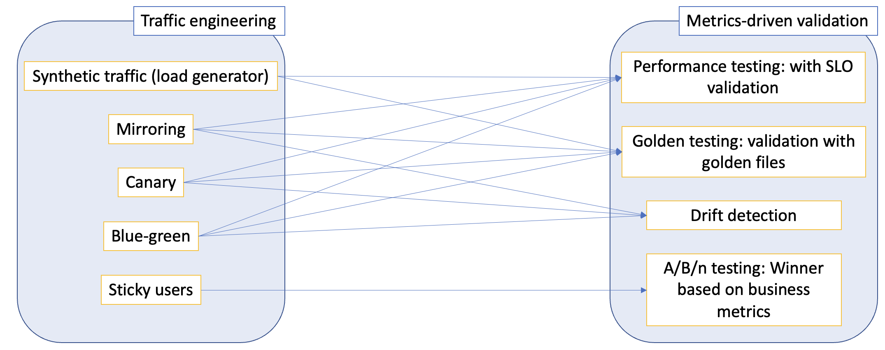

# Release Engineering and Optimization for ML Models using Iter8

## Keywords

Iter8, experiment, A/B testing, Performance testing, traffic engineering, canary, blue-green, mirroring, model serving, metrics collection, version 

## What is Iter8?

[Iter8](https://iter8.tools) is the open source Kubernetes release engineering and optimization tool built for MLOps, data science, and platform engineering teams. Iter8 detects new versions of ML models in the cluster and optimizes their release.

## User Use Cases

Iter8 simplifies traffic engineering and metrics-based testing/validation for ML inference services running in Kubernetes/OpenShift clusters. Specific usecases are illustrated below.

## Advantages of Iter8+service-mesh over vanilla service-mesh

**Reliable route automation:** Iter8 controller dynamically reconfigures routing resources based on the state of ML inference services. As part of this dynamic reconfiguration, Iter8 also looks into readiness (for e.g., in a KServe modelmesh based inference service), availability (for e.g., in a Kubernetes deployment based inference service) and other relevant status conditions before configuring traffic splits to candidate versions of the inference service. Similarly, before candidate versions are deleted, Iter8 controller uses finalizers to first ensure that all traffic flows to the primary version of the inference service. This makes for a very high-degree of reliability and zero-downtime/loss-less rollouts of new inference service versions. Users do not get this reliability automatically with a vanilla service mesh.

**Ease-of-use/reduced barrier to entry:**  Platform engineers/SREs/MLOps/data science teams may not all come with the level of expertise needed for configuring routing resources for the traffic engineering use-cases supported by Iter8. Further, CRDs (like KServe modelmesh) bring an additional layer of complexity since they define their own networking mechanisms (e.g., gRPC headless services in the case of modelmesh). With Iter8, the barrier to entry for end-users is significantly reduced. In particular, by just providing names of their ML serving resources, and (optional) traffic weights/labels, endusers can get started with their release optimization use cases rapidly. Further, Iter8 does not limit the capabilities of the underlying service mesh in anyway. This means more advanced teams still get to use all the power of the service-mesh alongside the reliability and ease-of-use that Iter8 brings.

**Metrics-driven assessments of candidate versions including A/B/n testing:** Traffic engineering is merely "one-half" of Iter8 functionality as shown in the illustration. Another complementary side involves metrics-driven experiments. During a canary release, how does the user evaluate the canary version? Perhaps the user wants to split traffic between the primary and candidate versions (can be multiple), compare them in terms of business metrics such as conversion rate, engagement, revenue, sales, or any application metric that the business owners care about, and determine the winning version to be promoted. This is classic A/B/n testing for which Iter8 has significant built-in support, both for metrics collection and comparison/assessment of versions. Users can also use Iter8 for other types of validation such as SLOs, and performance tests. Clearly, vanilla service mesh does not deliver any of these features for users.

## Architecture and Implementation

Iter8 consists of three components, namely, a Kubernetes traffic controller, a CLI for orchestrating experiments, and a gRPC-based client SDK that simplifies A/B/n testing of ML models in production.

### Kubernetes traffic controller
Iter8 provides a Kubernetes traffic controller that can be installed using Helm or Kustomize. This controller automatically and dynamically reconfigures Kubernetes routing resources based on the state of ML model versions. The following picture illustrates a Blue-Green rollout scenario that is orchestrated by this controller.

### CLI for experiments
Iter8 introduces the notion of an experiment, and provides a CLI for executing experiments and retrieving their results. An experiment is simply a list of tasks that are executed in a specific sequence. The following picture illustrates a performance testing and SLO validation experiment for a Kubernetes app/ML model (inference service); this experiment consists of three tasks.

In addition to performance testing and SLO validation for HTTP and gRPC services, Iter8 experiments can also be used to compare versions of an app/ML model in terms of their business metrics, and perform SLO validation using metrics from custom databases (such as Prometheus).

### Client SDK
Iter8 provides a client-side SDK to facilitate routing as well as metrics collection task associated with distributed (i.e., client-server architecture-based) A/B/n testing in Kubernetes. The following picture illustrates the use of the SDK for A/B testing of ML models.

Iter8's SDK is designed to handle user stickiness, collection of business metrics, and decoupling of front-end and back-end release processes during A/B/n testing. The cluster-side functionality needed by this SDK is handled by the traffic controller described above. Application developers who wish to use this SDK, embed the client APIs as part of their (front-end) application code.

## Owners Information and Maintenance Plan

### IBM Research

* [Alan Cha](https://github.com/Alan-Cha)
* [Michael Kalantar](https://github.com/kalantar)
* [Srinivasan Parthasarathy](https://github.com/sriumcp)
* [Atin Sood](https://github.com/atinsood)

### Red Hat

* [Taneem Ibrahim](https://github.com/taneem-ibrahim)
